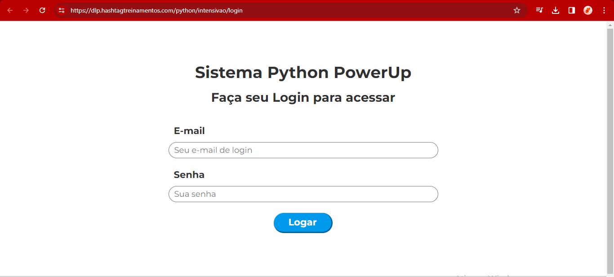

# Automation Project 

This is a project that focus on automating a continuous task, 
on the computer itself, made using pyautoguy to do the clicking and the texting.

The Automation will use this [website](https://dlp.hashtagtreinamentos.com/python/intensivao/login) made by "hashtag treinamentos" for a simple way to test my skills and verify the code.

The site is in Portuguese but I'll be loking for it's functionality. for a while, i'll use this until I know how to make this type of website.

The data base is the file named products.csv, this file will contain a lot of produtcs and their respective type, cost, code and mark for me to keep track.

So the objective of this Project is to use have someone click once to start the program (maybe a .exe file or something easy-like) and the computer will open google, write the site, login with the right user and key, enter, take all the products in the products.csv file and register all of them.

In the future I'll revisit this code to make a website that uses this database and the registration to make a simple way to do a kinda of power BI with python or java in the website.

***If the program has malfunction, please set your mouse to the upper-right corner of you screen, this will trigger a failsafe.***